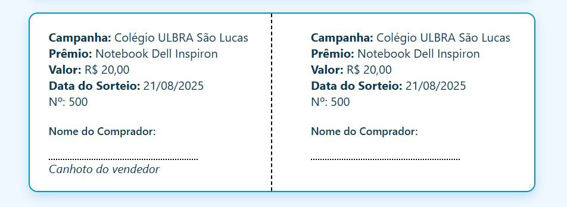

## 🖥️ Como Usar

1. Abra o arquivo `index.html` em um servidor local (ex: XAMPP, WampServer).
2. Preencha os dados da rifa no formulário.
3. Clique no botão `GERAR BILHETES`.
4. Os bilhetes serão exibidos em tela com botão de **Imprimir**.

> 💡 **Dica**: Utilize papel A4 e defina margens mínimas ao imprimir.

## 🖨️ Impressão

O CSS inclui regras específicas para impressão (`@media print`), gerando bilhetes limpos, com divisões visuais e espaço para preenchimento do comprador.

## 🔒 Requisitos

- Servidor local com PHP (ex: XAMPP, WampServer)
- Navegador moderno (Chrome, Firefox, Edge)

## ❌ O que não usamos

- Nenhuma biblioteca ou framework externo
- Nenhum código JavaScript
- Nenhum banco de dados

## 📸 Exemplo de Uso

 <!-- opcional, se tiver imagem -->

---

Feito com 💙 para avaliações, rifas escolares e arrecadações solidárias.
